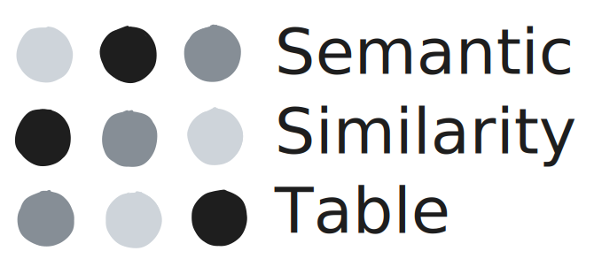

  

# Semantic Similarity Table
Drag and drop your Excel or CSV file with a text column for batch calculating semantic similarity for your queries.

**App here: https://do-me.github.io/semantic-similarity-table/**

## Short explanation 

For every text cell, the text is chunked and the chunks inferenced with model2vec. The resulting embeddings are compared against the query embeddings with cosine distance. Based on this distance, the mean and max similarity as well as the chunk with the highest similarity are calculated. Additionally, the number of chunks per row and the embeddings themselves can be added to the table.

- Input: a csv or xlsx/xls with at least 1 column with any kind of text of any length
- Output: the same table in the same format as the input (csv or xlsx/xls) with added columns

Feel free to ask questions in the issues or discussions!

## Motivation
Many of my colleagues deal with Excel tables all day long and use them as main data interface. Even though Excel has plenty of issues (cells limited to 32k chars, poor performance, compatibility, data types mess etc.) it's business reality. As I want to empower the average user, I thought it might be the right approach not to choose a dedicated UI but instead adapt to the user. In case you are more of an advanced user, you can use a csv as well and have no limitation considering max chars per cell. 

I am using the minishlab models on purpose as this is a tool for the "GPU poor" masses. It should work well and very performant on any kind of device (phone, consumer-grade laptops, cross-browser, cross-OS) on CPU. I might add the option for regular embedding models via transformers.js with the new WebGPU feature too at some point for the absolute best embedding quality but for the moment I prefer to keep it simple. For experts, the source code is very easy to modify. Feel free to ping me for questions!

Also have a look at my other projects, foremostly [SemanticFinder](https://do-me.github.io/SemanticFinder/) where you have an expert tool for semantic similarity. Other projects anbout local AI, semantic similarity and semantic search:
- [JS Text Chunker](https://do-me.github.io/js-text-chunker/)
- [SDG Analyzer](https://github.com/do-me/SDG-Analyzer)
- [Geospatial Semantic Search](https://do-me.github.io/semantic-hexbins/)
- [Qdrant Frontend](https://do-me.github.io/qdrant-frontend/)

**I'm available as freelancer for anything related to AI, LLMs, NLP and particularly semantic search and RAG - let's connect on [LinkedIn](https://www.linkedin.com/in/dominik-weckm%C3%BCller/)!**
